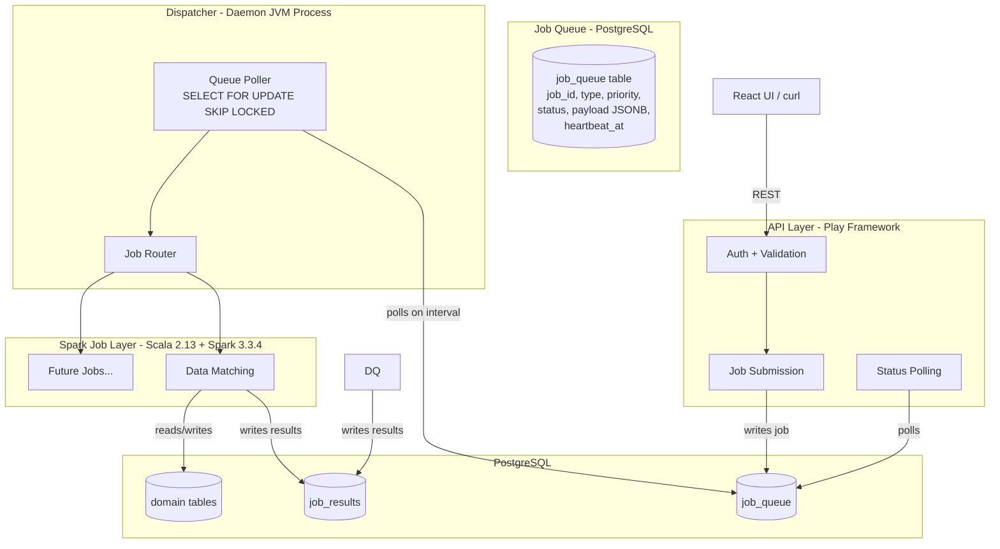
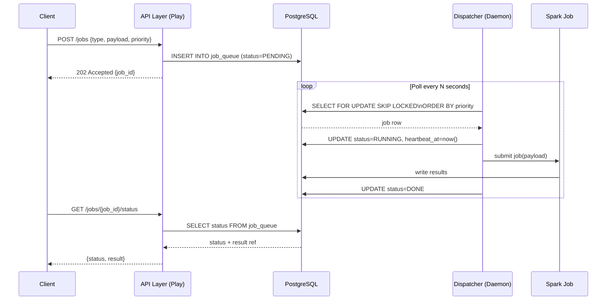
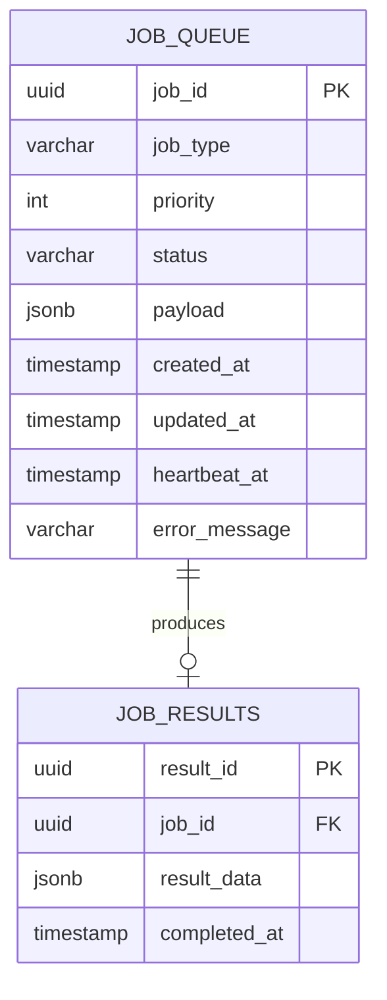

# High Level Design (HLD)
> ransack-racoon | v0.1 | Status: Draft

---

## 1. System Overview

A multi-tenant, org-scoped data processing platform with async Spark job execution, priority-based scheduling, and clean separation of concerns across all layers.

---

## 2. System Architecture



---

## 3. Separation of Concerns

| Module | Responsibility | Knows About |
|---|---|---|
| **API Layer** | HTTP in/out, auth, validation, job submission | Queue only |
| **Dispatcher** | Queue polling, priority-based routing | Queue + Job runners |
| **Spark Jobs** | Pure computation, self-contained | Data payload only |
| **PostgreSQL** | State, results, domain data | Nothing |
| **Common** | Shared models, DB access, utilities | Used by all |

> **Key Principle:** Spark jobs are completely blind to the API. They only consume a payload and write results. Zero coupling.

---

## 4. Async Job Flow



---

## 5. Job Queue Schema (Draft)



---

## 6. Repo Structure (Monorepo)

```
ransack-racoon/
├── api/                  # Play Framework app
│   ├── controllers/
│   ├── services/
│   └── routes
├── dispatcher/           # Standalone daemon JVM process
│   ├── poller/
│   └── router/
├── spark-jobs/           # Pure Spark computation modules
│   ├── data-matching/
│   ├── data-quality/
│   └── common-spark/
├── common/               # Shared: models, DB access, config
│   ├── models/
│   ├── db/
│   └── config/
├── docs/                 # All design docs live here
│   └── HLD.md
└── docker-compose.yml
```

---

## 7. Technology Stack

| Layer | Technology |
|---|---|
| UI | React |
| API | Play Framework (Scala) |
| Dispatcher | Scala (standalone JVM daemon) |
| Spark Jobs | Scala 2.13.16 + Spark 3.3.4 |
| Database | PostgreSQL |
| Queue | PostgreSQL (DB-backed, `SELECT FOR UPDATE SKIP LOCKED`) |
| Build Tool | SBT (multi-module) |

---

## 8. Key Design Decisions

| Decision | Choice | Reason |
|---|---|---|
| Job Queue | Postgres-backed | Low volume, no Kafka overhead needed, ~1000 users/org |
| Dispatcher | Separate JVM daemon | Independent crash boundary, debuggable in isolation |
| Job status | API polls Postgres | Simple, no callback infra needed at this scale |
| Monorepo | Single repo, multiple modules | Shared `common`, single deploy, clean boundaries |
| Spark ↔ API coupling | Zero | Spark jobs only consume payload, write results |

---

*Next: LLD per module — start with Spark Data Matching job*