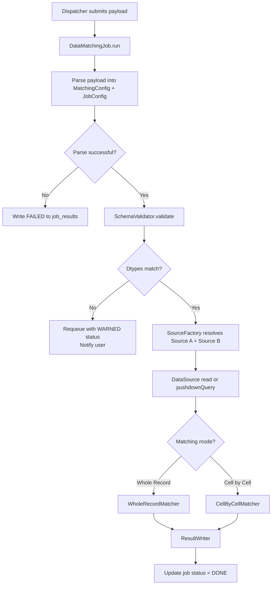
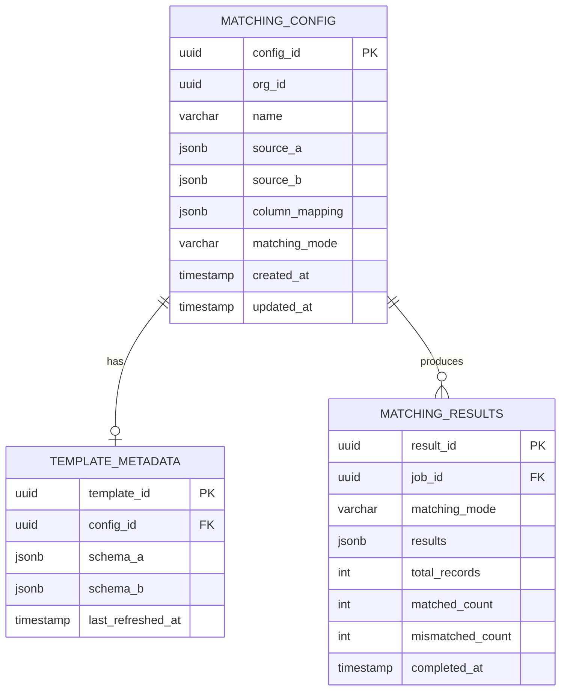

# LLD — Data Matching Job
> ransack-racoon | v0.1 | Status: Draft
> References: HLD.md, ADR-012, ADR-013, ADR-014, ADR-015, ADR-016

---

## 1. Responsibility

Accepts a job payload from the dispatcher, validates source schemas, loads data from pluggable sources, and performs column-level matching (whole record or cell-by-cell) between two datasets. Writes results to PostgreSQL. Completely blind to API layer.

---

## 2. Module Structure

```
spark-jobs/
└── data-matching/
    └── src/main/scala/com/ransack/matching/
        ├── DataMatchingJob.scala        # entry point
        ├── config/
        │   ├── MatchingConfig.scala     # domain config snapshot — case class
        │   └── JobConfig.scala          # runtime config snapshot — case class
        ├── source/
        │   ├── DataSource.scala         # pluggable source trait
        │   ├── JdbcSource.scala
        │   ├── CsvSource.scala
        │   ├── ParquetSource.scala
        │   ├── JsonSource.scala
        │   └── SourceFactory.scala      # resolves source impl from config
        ├── validation/
        │   ├── SchemaValidator.scala    # dtype pre-flight — pure function
        │   └── ValidationError.scala   # sealed trait ADT for all error types
        ├── matching/
        │   ├── MatchingEngine.scala     # orchestrates matching mode selection
        │   ├── WholeRecordMatcher.scala
        │   └── CellByCellMatcher.scala
        └── sink/
            └── ResultWriter.scala       # writes to postgres — side effect boundary
```

---

## 3. Job Entry Flow



---

## 4. Component Responsibilities

### DataSource (trait)
- contract for all source implementations
- every source must implement `read` — returns a DataFrame or error
- sources that support pushdown optionally implement `pushdownQuery`
- `SourceFactory` resolves the correct impl based on `source_type` in config
- adding a new source = new impl of this trait, zero changes elsewhere

### SchemaValidator
- pure function — no I/O, no side effects
- takes schema of source A, schema of source B, and column mapping
- returns all validation errors at once (not just first)
- errors: column not found, dtype mismatch
- caller decides what to do with errors — validator just reports

### MatchingEngine
- orchestrates which matcher to invoke based on `matching_mode` in config
- delegates entirely to `WholeRecordMatcher` or `CellByCellMatcher`
- no matching logic lives here

### WholeRecordMatcher
- joins source A and source B on primary key columns
- compares full rows — produces MATCH / MISMATCH / ONLY_IN_A / ONLY_IN_B per record
- pure transformation — input DataFrames, output result DataFrame

### CellByCellMatcher
- joins source A and source B on primary key columns
- per value column: compares A value vs B value
- produces per-cell match status — MATCH or MISMATCH
- pure transformation — input DataFrames, output result DataFrame

### ResultWriter
- only component allowed to write to PostgreSQL
- single side effect boundary for the entire job
- writes result DataFrame + updates job status

---

## 5. Side Effect Boundary

```mermaid
flowchart LR
    subgraph Pure Core
        V[SchemaValidator]
        WR[WholeRecordMatcher]
        CBC[CellByCellMatcher]
        ME[MatchingEngine]
    end

    subgraph Side Effects
        DS[DataSource.read]
        RW[ResultWriter.write]
        LOG[Logger]
    end

    DS -->|DataFrame| Pure Core
    Pure Core -->|Result DataFrame| RW
    Pure Core -->|ValidationError| LOG
```

Pure core has zero I/O — only transforms data. All I/O lives at the edges. Enforced by ADR-013.

---

## 6. Config Contracts

**MatchingConfig (snapshotted at job submission):**
- source A definition — type, connection params, pushdown flag + query if applicable
- source B definition — same
- column mapping — primary key columns, value column pairs (A col → B col)
- matching mode — WholeRecord or CellByCell

**JobConfig (snapshotted at job submission):**
- priority, timeout, max retries, triggered_by

Both are immutable once in the queue. See ADR-014.

---

## 7. Result Schema

**Whole Record output:**
```
| primary_key | match_status | record_a | record_b |
```
`match_status` values: `MATCH` | `MISMATCH` | `ONLY_IN_A` | `ONLY_IN_B`

**Cell by Cell output:**
```
| primary_key | column_name | value_a | value_b | match_status |
```
`match_status` values: `MATCH` | `MISMATCH`

---

## 8. Error Handling Strategy

| Error Type | Handling | Job Status |
|---|---|---|
| Payload parse failure | Log + fail immediately | `FAILED` |
| Column not found | Log all missing cols + fail | `FAILED` |
| Dtype mismatch | Log all mismatches + requeue with warning | `WARNED` |
| Source read failure | Log + fail with source error | `FAILED` |
| Matching logic error | Log + fail | `FAILED` |
| Max retries exceeded | Log + terminal fail | `FAILED` |

---

## 9. DB Schema



---

## 10. Open Questions
> Resolve before implementation starts

- [ ] Max retry count on dtype mismatch requeue — limit? (ADR-016 watch item)
- [ ] Notification system design — how does WARNED status reach user? (TBD)
- [ ] Whole record matching strategy — row hash vs column-by-column equality?
- [ ] Result storage — full result in JSONB or separate rows per record?
- [ ] Timezone config for EOD refresh daemon — per org or global?

---