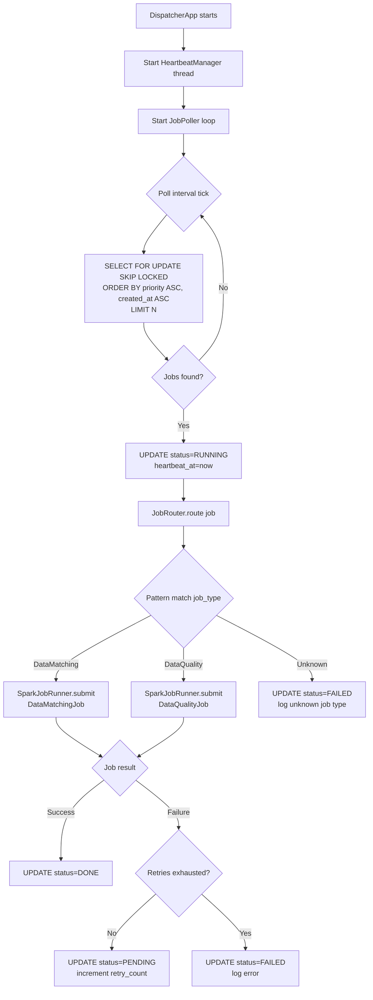
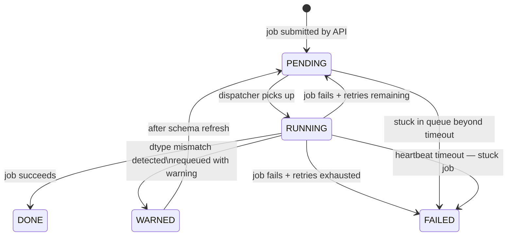
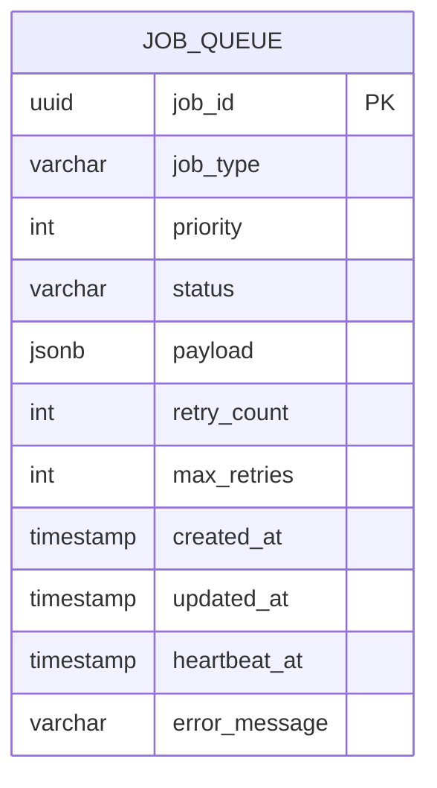

# LLD — Dispatcher
> ransack-racoon | v0.1 | Status: Draft
> References: HLD.md, ADR-004, ADR-013, ADR-017

---

## 1. Responsibility

Standalone JVM daemon. Polls the job queue, picks jobs by priority, routes to correct Spark job runner via pattern match, manages job lifecycle (status updates, heartbeat, retries). Completely independent of API layer.

---

## 2. Module Location

```
dispatcher/
└── src/main/scala/com/ransack/dispatcher/
    ├── DispatcherApp.scala          # entry point — starts daemon
    ├── poller/
    │   └── JobPoller.scala          # polls postgres queue on interval
    ├── router/
    │   └── JobRouter.scala          # pattern matches job_type → runner
    ├── runner/
    │   └── SparkJobRunner.scala     # submits spark job, manages lifecycle
    ├── heartbeat/
    │   └── HeartbeatManager.scala   # updates heartbeat_at, detects stuck jobs
    └── config/
        └── DispatcherConfig.scala   # polling interval, thread pool size etc
```

---

## 3. Dispatcher Flow



---

## 4. Core Abstractions

### 4.1 Job Type ADT
```scala
sealed trait JobType
case object DataMatching extends JobType
case object DataQuality  extends JobType
// add new job types here — compiler enforces exhaustive match

object JobType {
  def fromString(s: String): Either[ParseError, JobType] = s match {
    case "DataMatching" => Right(DataMatching)
    case "DataQuality"  => Right(DataQuality)
    case unknown        => Left(ParseError(s"Unknown job type: $unknown"))
  }
}
```

---

### 4.2 Job Router
```scala
object JobRouter {
  def route(job: QueuedJob): Either[DispatchError, JobResult] =
    job.jobType match {
      case DataMatching => SparkJobRunner.submit[DataMatchingJob](job.payload)
      case DataQuality  => SparkJobRunner.submit[DataQualityJob](job.payload)
    }
}
```
- exhaustive pattern match — compiler error if new `JobType` added without handling
- pure routing — no side effects, just delegates to runner
- `Either` propagates errors up cleanly

---

### 4.3 Job Poller
```scala
class JobPoller(config: DispatcherConfig, router: JobRouter) {

  def poll(): Either[PollerError, List[JobResult]] =
    for {
      jobs    <- fetchJobs()
      results <- jobs.traverse(j => markRunning(j) *> router.route(j))
    } yield results

  private def fetchJobs(): Either[PollerError, List[QueuedJob]] = {
    // SELECT FOR UPDATE SKIP LOCKED
    // ORDER BY priority ASC, created_at ASC
    // LIMIT config.batchSize
  }

  private def markRunning(job: QueuedJob): Either[PollerError, Unit] = {
    // UPDATE job_queue SET status='RUNNING', heartbeat_at=now()
    // WHERE job_id = job.jobId
  }
}
```
- `traverse` — FP way to map over list and collect `Either` results
- batch polling — picks N jobs per tick, not one at a time

---

### 4.4 Heartbeat Manager
```scala
class HeartbeatManager(config: DispatcherConfig) {

  // runs on separate thread, every N seconds
  def tick(): Unit = {
    updateHeartbeats()   // UPDATE heartbeat_at=now() for all RUNNING jobs
    detectStuckJobs()    // find RUNNING jobs where heartbeat_at < now() - timeout
  }

  private def detectStuckJobs(): Either[HeartbeatError, Unit] = {
    // SELECT jobs WHERE status=RUNNING AND heartbeat_at < now() - interval
    // mark as FAILED or requeue depending on retry_count
  }
}
```
- runs independently from poller — separate thread
- stuck job detection prevents queue lockup from crashed spark jobs
- timeout threshold comes from `job_config.timeoutSeconds` snapshotted in payload

---

### 4.5 Spark Job Runner
```scala
object SparkJobRunner {
  def submit[T <: SparkJob](payload: JobPayload): Either[RunnerError, JobResult] = {
    // deserialize payload
    // instantiate correct job via type param
    // call job.run(payload)
    // return result or error
  }
}

trait SparkJob {
  def run(payload: JobPayload): Either[JobError, JobResult]
}
```
- `SparkJob` trait — every spark job must implement `run`
- type param `T` ensures only valid `SparkJob` impls can be submitted
- result always `Either` — no exceptions escape runner boundary

---

## 5. Job Lifecycle State Machine



---

## 6. Concurrency Model

```
DispatcherApp
├── Thread 1: JobPoller         — polls every N seconds, submits batch
├── Thread 2: HeartbeatManager  — ticks every M seconds, detects stuck jobs
└── Thread Pool: SparkJobRunner — bounded thread pool, max concurrent jobs = K
```

- `N`, `M`, `K` all configurable in `DispatcherConfig`
- thread pool prevents unbounded spark job spawning
- poller and heartbeat are independent — heartbeat failure never kills poller

---

## 7. Dispatcher Config
```scala
case class DispatcherConfig(
  pollIntervalSeconds: Int,       // how often to poll queue
  heartbeatIntervalSeconds: Int,  // how often to update heartbeat
  batchSize: Int,                 // jobs picked per poll tick
  maxConcurrentJobs: Int,         // thread pool size
  stuckJobTimeoutSeconds: Int     // heartbeat age before job flagged stuck
)
```

---

## 8. Error Handling Strategy

| Error Type | Handling | Job Status |
|---|---|---|
| Unknown job type | Log + fail immediately | `FAILED` |
| Payload parse failure | Log + fail immediately | `FAILED` |
| Spark job failure + retries left | Requeue | `PENDING` |
| Spark job failure + retries exhausted | Log + terminal fail | `FAILED` |
| Stuck job detected by heartbeat | Log + terminal fail | `FAILED` |
| Source access failure | Retry up to 3x with backoff (ADR-017) | `FAILED` after 3x |
| Schema refresh failure | Retry once (ADR-017) | `FAILED` after 1x |

---

## 9. DB Schema (Dispatcher specific additions)


- `retry_count` — incremented on each requeue
- `max_retries` — snapshotted from `job_config` at submission
- `heartbeat_at` — updated by HeartbeatManager every tick

---

## 10. Open Questions
> Resolve before implementation starts

- [ ] Polling interval default — what's acceptable latency between job submission and pickup? 5s? 10s?
- [ ] Max concurrent jobs default — how many spark jobs can run in parallel per dispatcher instance?
- [ ] WARNED status requeue — does it go back to original priority or bumped up?
- [ ] Stuck job handling — terminal FAILED or one last retry attempt?

---